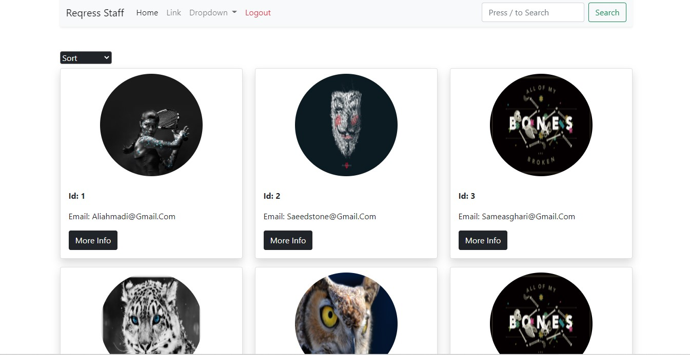
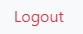
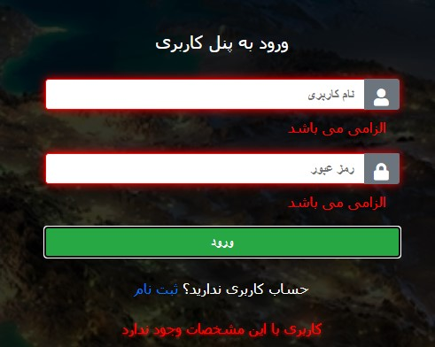

# HTTP Login System
Back-End of this app is raw javascript and based on simple routing system and HTTP method server.

### Application Features
- login page
  
  
- panel  
  this app is working with another application of [`reqres staff`](https://github.com/mrRamezanzad/Reqress_Staff) and has all features of that application but in one condition which is you have to ***be logged in first***.

  
  
  > you can see more details about panel app in the [`reqres staff's`](https://github.com/mrRamezanzad/Reqress_Staff) application page on github.

- logout  
    logout link in navbar will take you to login page and out of panel then you won't be able to get back into the panel ***if you are not logged in***, you constantly get ***redirected to login page***.

  

- proper messaging  
  - if you try to identify with fake or incorrect informations you'll get messages according to your request.

    

  - welcome message  
  if your login operation is successful, then you'll see a welcome message that disappears in a moment.

    